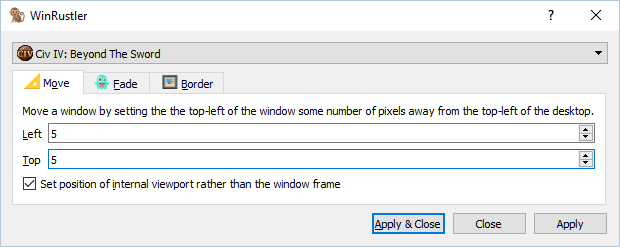
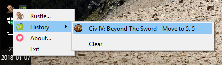

# WinRustler

Program for rustling windows in Windows. Lets you set window position. Can also
try setting opacity or removing the border/window frame. Has a GUI.

## It looks like this

This dialog lets you select your window and what to do to it. When you rustle a window, it'll show up in the history in the tray so they can be run again later on windows matching the same window title.

This is the tray icon and history menu.

